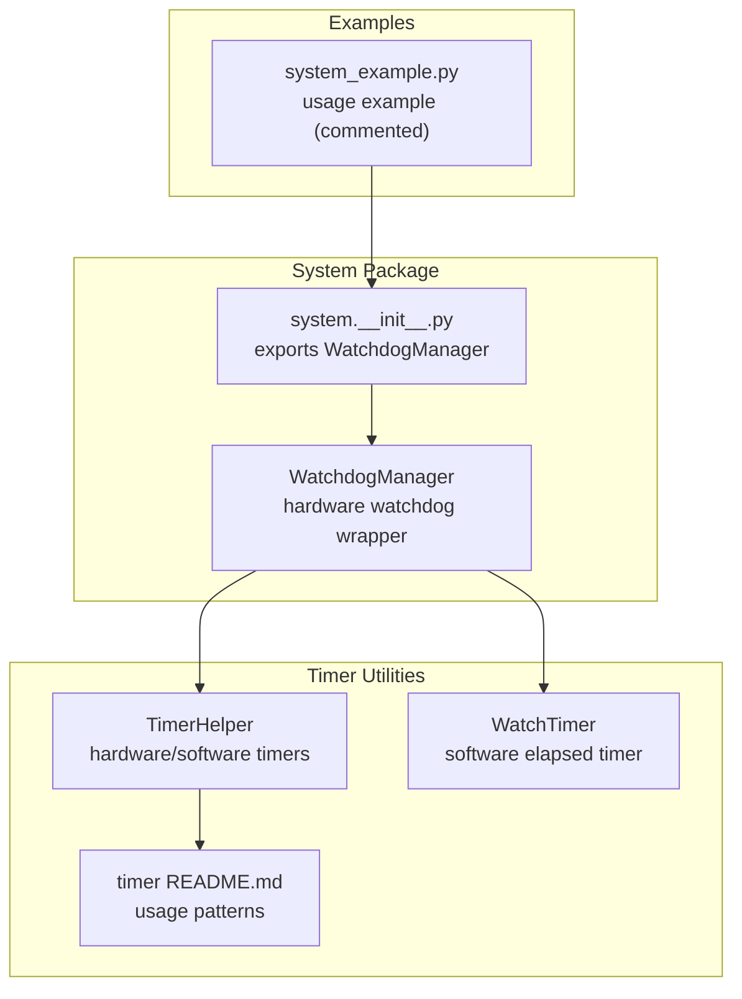
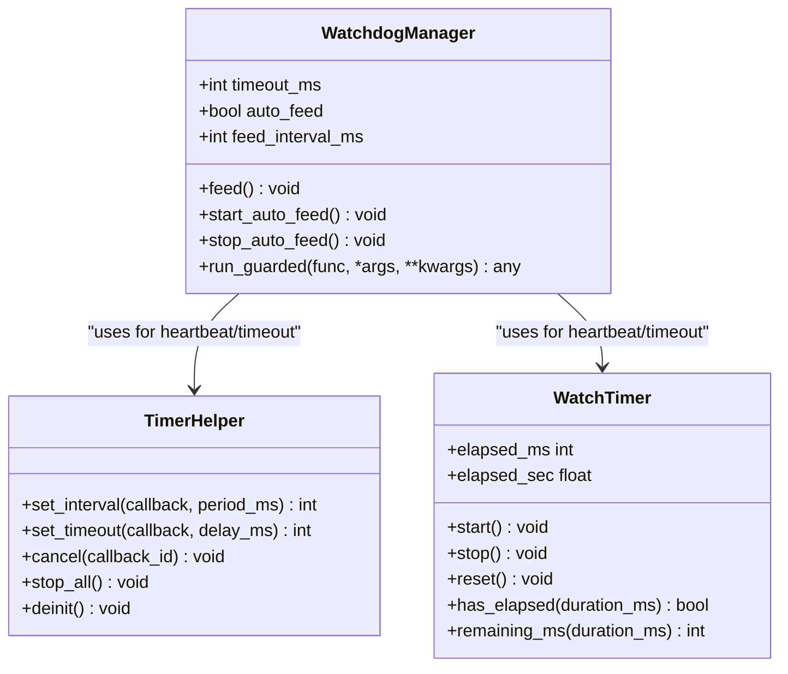
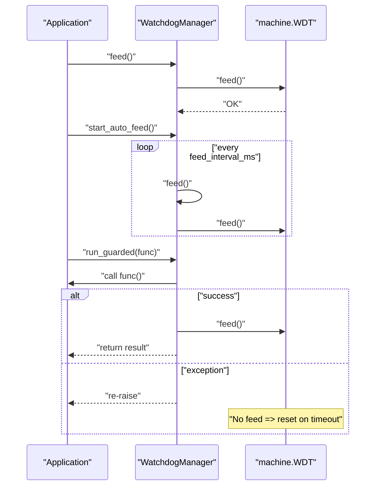
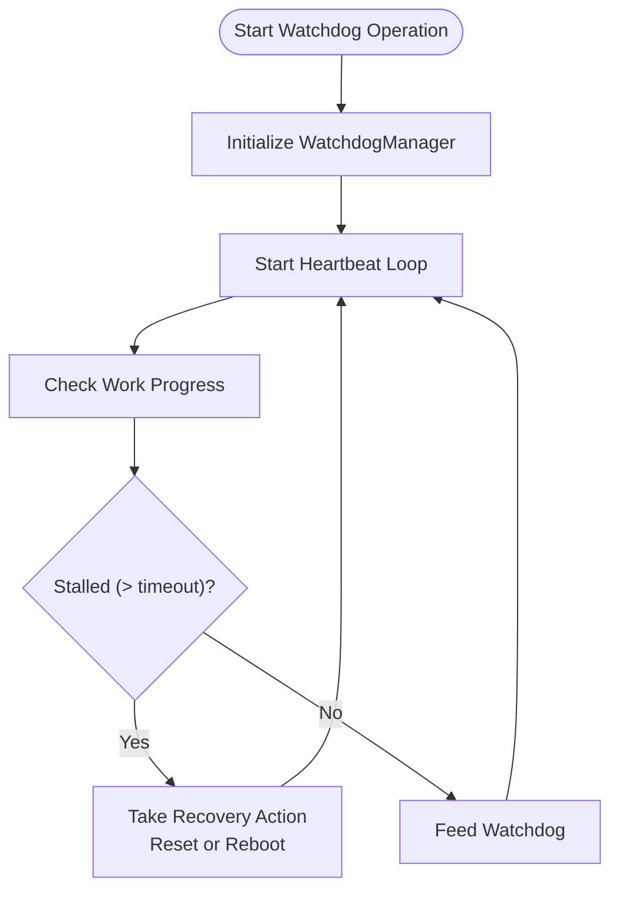
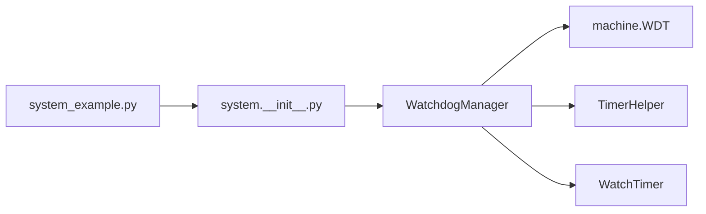

# Watchdog System

<cite>
**Referenced Files in This Document**
- [watchdog.py](file://src/lib/system/watchdog.py)
- [__init__.py](file://src/lib/system/__init__.py)
- [system_example.py](file://src/main/examples/system_example.py)
- [timer_helper.py](file://src/lib/timer/timer_helper.py)
- [README.md](file://src/lib/timer/README.md)
</cite>

## Table of Contents
1. [Introduction](#introduction)
2. [Project Structure](#project-structure)
3. [Core Components](#core-components)
4. [Architecture Overview](#architecture-overview)
5. [Detailed Component Analysis](#detailed-component-analysis)
6. [Dependency Analysis](#dependency-analysis)
7. [Performance Considerations](#performance-considerations)
8. [Troubleshooting Guide](#troubleshooting-guide)
9. [Conclusion](#conclusion)
10. [Appendices](#appendices)

## Introduction
This document describes the watchdog system implementation for embedded reliability on ESP32-C3 using MicroPython. It covers hardware watchdog configuration, automatic feeding strategies, timeout handling, and safe feeding patterns. It also documents operation modes, timeout configuration, and how to integrate watchdog protection with guarded execution. Practical examples are referenced from system_example.py, and supporting timer utilities are documented from the timer module.

## Project Structure
The watchdog system is implemented as a wrapper around the MicroPython machine.WDT hardware watchdog. It is exposed via the system package and integrated into example applications. Supporting timer utilities are provided by the timer module for heartbeat and timeout monitoring.

**Diagram sources**
- [watchdog.py:1-38](file://src/lib/system/watchdog.py#L1-L38)
- [__init__.py:1-5](file://src/lib/system/__init__.py#L1-L5)
- [system_example.py:1-42](file://src/main/examples/system_example.py#L1-L42)
- [timer_helper.py:1-237](file://src/lib/timer/timer_helper.py#L1-L237)
- [README.md:1-150](file://src/lib/timer/README.md#L1-L150)

**Section sources**
- [watchdog.py:1-38](file://src/lib/system/watchdog.py#L1-L38)
- [__init__.py:1-5](file://src/lib/system/__init__.py#L1-L5)
- [system_example.py:1-42](file://src/main/examples/system_example.py#L1-L42)
- [timer_helper.py:1-237](file://src/lib/timer/timer_helper.py#L1-L237)
- [README.md:1-150](file://src/lib/timer/README.md#L1-L150)

## Core Components
- WatchdogManager: Provides hardware watchdog control, automatic feeding loop, and guarded execution semantics.
- TimerHelper and WatchTimer: Software and hardware-backed timer utilities that support heartbeat and timeout monitoring patterns.

Key capabilities:
- Configure watchdog timeout in milliseconds.
- Feed the watchdog manually or automatically at a configurable interval.
- Run guarded functions that feed on successful completion and propagate exceptions without feeding to trigger a reset when failure is detected.
- Use software timers to implement heartbeat and timeout checks alongside the hardware watchdog.

**Section sources**
- [watchdog.py:9-38](file://src/lib/system/watchdog.py#L9-L38)
- [timer_helper.py:23-172](file://src/lib/timer/timer_helper.py#L23-L172)
- [timer_helper.py:174-237](file://src/lib/timer/timer_helper.py#L174-L237)

## Architecture Overview
The watchdog system integrates with the MicroPython machine.WDT hardware watchdog. The WatchdogManager encapsulates initialization, feeding, and guarded execution. Timer utilities support heartbeat and timeout monitoring, enabling robust watchdog operation modes.

**Diagram sources**
- [watchdog.py:9-38](file://src/lib/system/watchdog.py#L9-L38)
- [timer_helper.py:23-172](file://src/lib/timer/timer_helper.py#L23-L172)
- [timer_helper.py:174-237](file://src/lib/timer/timer_helper.py#L174-L237)

## Detailed Component Analysis

### WatchdogManager
The WatchdogManager wraps machine.WDT to provide:
- Initialization with a configurable timeout in milliseconds.
- Manual feeding via feed().
- Automatic feeding loop controlled by start_auto_feed() and stop_auto_feed().
- Guarded execution via run_guarded(), which feeds on success and re-raises exceptions to allow a reset on failure.

Operational modes:
- Manual mode: Application calls feed() periodically.
- Automatic mode: start_auto_feed() runs a loop that feeds at feed_interval_ms until stopped.

Safe feeding patterns:
- Use run_guarded() to ensure feeding occurs only on successful function completion.
- Avoid feeding on exceptions to allow the watchdog to reset the system in a fail-safe manner.

**Diagram sources**
- [watchdog.py:9-38](file://src/lib/system/watchdog.py#L9-L38)

**Section sources**
- [watchdog.py:9-38](file://src/lib/system/watchdog.py#L9-L38)

### Timer Utilities for Watchdog Operation
TimerHelper supports periodic and one-shot callbacks, with automatic fallback to software timers when hardware timers are unavailable. WatchTimer provides software elapsed-time tracking suitable for heartbeat and timeout checks.

Typical usage patterns:
- Heartbeat: Start a WatchTimer and feed the watchdog when elapsed_ms < timeout_ms.
- Timeout monitoring: Use WatchTimer.has_elapsed() to detect stalls and trigger recovery actions.

**Diagram sources**
- [timer_helper.py:23-172](file://src/lib/timer/timer_helper.py#L23-L172)
- [timer_helper.py:174-237](file://src/lib/timer/timer_helper.py#L174-L237)
- [README.md:79-111](file://src/lib/timer/README.md#L79-L111)

**Section sources**
- [timer_helper.py:23-172](file://src/lib/timer/timer_helper.py#L23-L172)
- [timer_helper.py:174-237](file://src/lib/timer/timer_helper.py#L174-L237)
- [README.md:79-111](file://src/lib/timer/README.md#L79-L111)

### Integration Example References
- system_example.py demonstrates importing system modules but currently comments out the watchdog import. This indicates the availability of WatchdogManager via system.__init__.py exports.

Practical steps:
- Import WatchdogManager from system.watchdog.
- Initialize with desired timeout_ms and optional auto_feed and feed_interval_ms.
- Use run_guarded() for critical tasks.
- Optionally start automatic feeding during long-running operations.

**Section sources**
- [system_example.py:1-42](file://src/main/examples/system_example.py#L1-L42)
- [__init__.py:1-5](file://src/lib/system/__init__.py#L1-L5)

## Dependency Analysis
WatchdogManager depends on machine.WDT for hardware watchdog control. It optionally cooperates with TimerHelper and WatchTimer for heartbeat and timeout monitoring. The system package exposes WatchdogManager via system.__init__.py.

**Diagram sources**
- [system_example.py:1-42](file://src/main/examples/system_example.py#L1-L42)
- [__init__.py:1-5](file://src/lib/system/__init__.py#L1-L5)
- [watchdog.py:5-6](file://src/lib/system/watchdog.py#L5-L6)
- [timer_helper.py:16-20](file://src/lib/timer/timer_helper.py#L16-L20)

**Section sources**
- [system_example.py:1-42](file://src/main/examples/system_example.py#L1-L42)
- [__init__.py:1-5](file://src/lib/system/__init__.py#L1-L5)
- [watchdog.py:5-6](file://src/lib/system/watchdog.py#L5-L6)
- [timer_helper.py:16-20](file://src/lib/timer/timer_helper.py#L16-L20)

## Performance Considerations
- Feeding frequency: Set feed_interval_ms to be less than the configured timeout_ms to avoid premature resets.
- Blocking loops: start_auto_feed() uses blocking sleep; consider cooperative scheduling or separate threads if the application requires responsiveness.
- Exception safety: run_guarded() ensures feeding only on success, preventing unnecessary resets during failures.
- Timer accuracy: WatchTimer relies on time.ticks_ms(); use it for timeout checks and heartbeat intervals rather than relying solely on CPU cycles.

[No sources needed since this section provides general guidance]

## Troubleshooting Guide
Common issues and recovery procedures:
- Frequent resets: Reduce workload or increase timeout_ms; ensure feed_interval_ms is smaller than timeout_ms.
- No feeding in automatic mode: Verify start_auto_feed() is running and not blocked by long-running tasks.
- Exceptions not feeding: run_guarded() intentionally avoids feeding on exceptions; confirm this behavior is desired for fail-safe resets.
- Debugging timeouts: Use WatchTimer to monitor progress and log elapsed_ms vs. timeout_ms to identify stalls.

Recovery procedures:
- Reset the device to clear watchdog state.
- Review watchdog configuration and feeding patterns.
- Add logging around guarded sections to track execution and feeding.

**Section sources**
- [watchdog.py:30-37](file://src/lib/system/watchdog.py#L30-L37)
- [timer_helper.py:174-237](file://src/lib/timer/timer_helper.py#L174-L237)

## Conclusion
The watchdog system provides a robust mechanism for embedded reliability on ESP32-C3. By combining hardware watchdog control with safe feeding patterns and heartbeat monitoring, applications can recover from hangs and detect unrecoverable faults. Use run_guarded() for critical sections, configure appropriate timeouts, and leverage TimerHelper and WatchTimer for heartbeat and timeout checks.

[No sources needed since this section summarizes without analyzing specific files]

## Appendices

### Best Practices for Watchdog Usage
- Always configure timeout_ms conservatively, ensuring feed_interval_ms leaves headroom.
- Prefer run_guarded() for critical tasks to guarantee feeding on success.
- Use WatchTimer for heartbeat and timeout checks to proactively detect stalls.
- Avoid long blocking operations without intermediate feeding or cooperative yielding.
- Document and test watchdog behavior under realistic load conditions.

[No sources needed since this section provides general guidance]