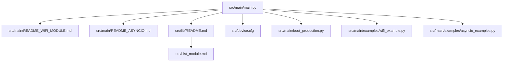
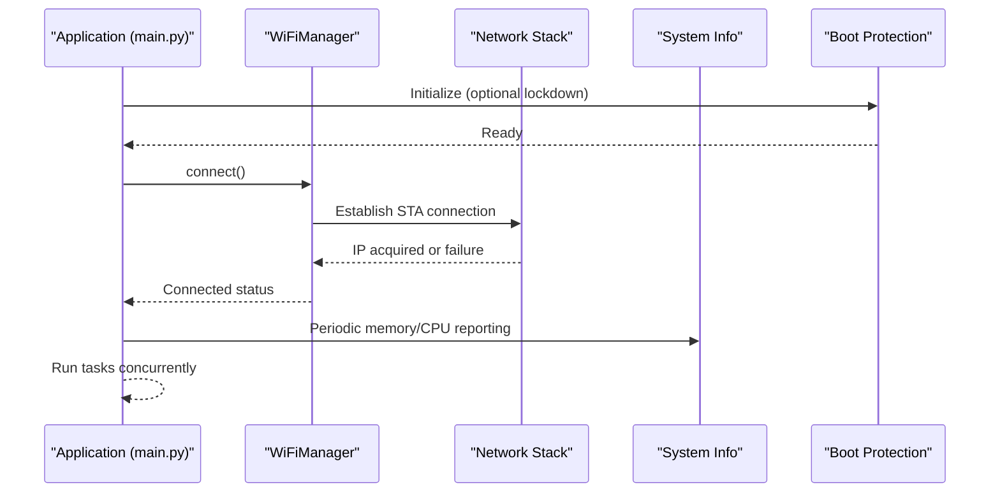
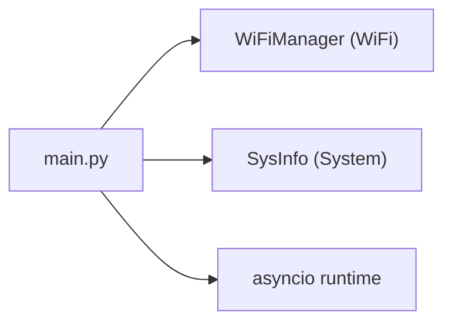

# Troubleshooting & FAQ

<cite>
**Referenced Files in This Document**
- [README_WIFI_MODULE.md](file://src/main/README_WIFI_MODULE.md)
- [wifi_example.py](file://src/main/examples/wifi_example.py)
- [README_ASYNCIO.md](file://src/main/README_ASYNCIO.md)
- [asyncio_examples.py](file://src/main/examples/asyncio_examples.py)
- [README.md](file://src/lib/README.md)
- [List_module.md](file://src/List_module.md)
- [device.cfg](file://src/device.cfg)
- [main.py](file://src/main/main.py)
- [boot_production.py](file://src/main/boot_production.py)
- [ENHANCEMENT_SUMMARY.md](file://src/ENHANCEMENT_SUMMARY.md)
</cite>

## Table of Contents
1. [Introduction](#introduction)
2. [Project Structure](#project-structure)
3. [Core Components](#core-components)
4. [Architecture Overview](#architecture-overview)
5. [Detailed Component Analysis](#detailed-component-analysis)
6. [Dependency Analysis](#dependency-analysis)
7. [Performance Considerations](#performance-considerations)
8. [Troubleshooting Guide](#troubleshooting-guide)
9. [Conclusion](#conclusion)
10. [Appendices](#appendices)

## Introduction
This document provides comprehensive troubleshooting and FAQ guidance for the ESP32-C3 MicroPython framework. It focuses on:
- WiFi connectivity issues, diagnostics, and fixes
- Sensor calibration and troubleshooting
- Memory management and optimization
- Async programming pitfalls and debugging techniques
- Performance tuning, memory usage patterns, and power consumption tips
- Frequently asked questions covering framework usage, hardware compatibility, configuration, and deployment
- Platform-specific considerations for ESP32-C3 limitations and capabilities
- Community resources, support channels, and contribution guidelines

## Project Structure
The framework organizes functionality into modular libraries under src/lib and example applications under src/main/examples. The main entry points demonstrate typical usage patterns for WiFi, async concurrency, and system monitoring.

**Diagram sources**
- [main.py:1-84](file://src/main/main.py#L1-L84)
- [README_WIFI_MODULE.md:1-470](file://src/main/README_WIFI_MODULE.md#L1-L470)
- [README_ASYNCIO.md:1-840](file://src/main/README_ASYNCIO.md#L1-L840)
- [README.md:1-72](file://src/lib/README.md#L1-L72)
- [device.cfg:1-16](file://src/device.cfg#L1-L16)
- [boot_production.py:1-56](file://src/main/boot_production.py#L1-L56)
- [wifi_example.py:1-338](file://src/main/examples/wifi_example.py#L1-L338)
- [asyncio_examples.py:1-234](file://src/main/examples/asyncio_examples.py#L1-L234)
- [List_module.md:1-358](file://src/List_module.md#L1-L358)

**Section sources**
- [README.md:1-72](file://src/lib/README.md#L1-L72)
- [List_module.md:1-358](file://src/List_module.md#L1-L358)
- [device.cfg:1-16](file://src/device.cfg#L1-L16)

## Core Components
- WiFi Manager: Provides STA mode connection, credential persistence, scanning, keep-alive, and optional captive portal configuration.
- Async Concurrency: Demonstrates cooperative multitasking, tasks, events, queues, timeouts, and structured patterns.
- System Utilities: Example main application demonstrates LED blinking, periodic system info logging, and graceful shutdown.
- Boot Protection: Optional lockdown via boot.py to restrict REPL and communication channels in production.

Key references:
- WiFi Manager API and usage patterns are documented in the WiFi module README and examples.
- Async patterns and anti-patterns are covered in the asyncio guide and examples.
- Boot protection and lockdown behavior are described in the boot script.

**Section sources**
- [README_WIFI_MODULE.md:163-270](file://src/main/README_WIFI_MODULE.md#L163-L270)
- [README_ASYNCIO.md:1-840](file://src/main/README_ASYNCIO.md#L1-L840)
- [main.py:1-84](file://src/main/main.py#L1-L84)
- [boot_production.py:1-56](file://src/main/boot_production.py#L1-L56)

## Architecture Overview
The framework follows a layered approach:
- Application layer: main.py orchestrates tasks and integrates WiFi and system monitoring.
- WiFi layer: WiFiManager handles connection lifecycle, scanning, and keep-alive.
- Async runtime: asyncio manages cooperative multitasking and scheduling.
- System layer: basic system info and boot protection.

**Diagram sources**
- [main.py:49-71](file://src/main/main.py#L49-L71)
- [README_WIFI_MODULE.md:223-242](file://src/main/README_WIFI_MODULE.md#L223-L242)
- [boot_production.py:40-48](file://src/main/boot_production.py#L40-L48)

## Detailed Component Analysis

### WiFi Connectivity Troubleshooting
Common symptoms and resolutions:
- Cannot connect to WiFi:
  - Verify SSID/password and router availability.
  - Increase timeout via configuration.
  - Use scanning to confirm visibility and signal strength.
- Credentials not saved:
  - Check filesystem write permissions and available flash space.
- Keep-alive not functioning:
  - Ensure keep_alive is invoked and interval is reasonable.
  - Confirm signal strength and router stability.
- Captive Portal not opening:
  - Ensure sufficient RAM for AP mode and HTML assets.
  - Confirm firmware supports AP mode.
  - Reduce concurrent services to free memory.
- Cannot access portal web UI:
  - Connect to the AP SSID advertised by the device.
  - Open http://192.168.4.1 in a browser.
  - Toggle WiFi on mobile devices to refresh DHCP.

Diagnostic steps:
- Load and inspect configuration before connecting.
- Use scanning to validate network presence and RSSI.
- Monitor status and connection info periodically.
- Enable keep-alive and observe reconnection behavior.

Operational references:
- Configuration options and API: [README_WIFI_MODULE.md:135-270](file://src/main/README_WIFI_MODULE.md#L135-L270)
- Example scenarios: [wifi_example.py:14-338](file://src/main/examples/wifi_example.py#L14-L338)

**Section sources**
- [README_WIFI_MODULE.md:438-462](file://src/main/README_WIFI_MODULE.md#L438-L462)
- [README_WIFI_MODULE.md:135-270](file://src/main/README_WIFI_MODULE.md#L135-L270)
- [wifi_example.py:14-338](file://src/main/examples/wifi_example.py#L14-L338)

### Sensor Calibration and Troubleshooting
Calibration and validation tips:
- DHT sensors: Retry reads on failure, apply averaging, and validate wiring with pull-up resistors.
- BMP280/BME280: Confirm I2C address selection and shared bus integrity.
- DS18B20: Verify 1-Wire pull-up and ROM-based addressing for multi-sensor setups.
- MPU-6050: Validate orientation and accelerometer/gyro ranges; use async loops for continuous monitoring.
- HC-SR04: Use median filtering and voltage dividers for 5V echo pins; avoid air gaps.
- ADS1115: Select appropriate gain and channel mapping; validate PGA settings.
- MAX30102: Ensure finger contact; use FIFO sampling and peak detection for heart rate.
- LDR/Soil Moisture: Use calibrated thresholds and averaging; avoid direct sunlight for LDR.
- PIR/RCWL-0516: Account for warm-up periods and detect motion reliably with debounce.
- MQ Gas: Calibrate in clean air; track ratio and PPM values; use digital alarm thresholds.
- INA219: Check shunt resistance and max current; watch for overflow conditions.
- OH49E: Calibrate midpoint in absence of magnetic field; use deviation and polarity.
- PZEM-004T: Verify UART wiring and slave address; monitor power metrics asynchronously.

Validation references:
- Sensor driver usage and examples: [List_module.md:32-56](file://src/List_module.md#L32-L56)
- Example demonstrations: [sensors_example.py:30-529](file://src/main/examples/sensors_example.py#L30-L529)

**Section sources**
- [List_module.md:32-56](file://src/List_module.md#L32-L56)
- [sensors_example.py:30-529](file://src/main/examples/sensors_example.py#L30-L529)

### Memory Management and Optimization
Guidelines:
- Limit queue sizes to prevent RAM exhaustion.
- Use periodic garbage collection in idle tasks.
- Prefer non-blocking queue operations when appropriate.
- Avoid creating closures in create_task; pass coroutines directly.
- Use __slots__ in frequently instantiated classes to reduce overhead.
- Minimize global mutable state; protect with locks when shared.
- Keep async loops responsive by yielding with await asyncio.sleep(0) during compute-heavy sections.

References:
- Memory and performance tips: [README_ASYNCIO.md:765-800](file://src/main/README_ASYNCIO.md#L765-L800)
- Example patterns: [asyncio_examples.py:146-234](file://src/main/examples/asyncio_examples.py#L146-L234)

**Section sources**
- [README_ASYNCIO.md:765-800](file://src/main/README_ASYNCIO.md#L765-L800)
- [asyncio_examples.py:146-234](file://src/main/examples/asyncio_examples.py#L146-L234)

### Async Programming Challenges and Debugging
Common pitfalls and remedies:
- Blocking time.sleep in async contexts; replace with asyncio.sleep variants.
- Long-running computations without yielding; break into chunks and yield periodically.
- Forgetting to await or schedule coroutines; use create_task or await appropriately.
- Race conditions on shared state; use locks or queues.
- Not re-raising CancelledError in cleanup handlers; always re-raise after cleanup.

References:
- Anti-patterns and best practices: [README_ASYNCIO.md:670-750](file://src/main/README_ASYNCIO.md#L670-L750)
- Practical examples: [asyncio_examples.py:146-234](file://src/main/examples/asyncio_examples.py#L146-L234)

**Section sources**
- [README_ASYNCIO.md:670-750](file://src/main/README_ASYNCIO.md#L670-L750)
- [asyncio_examples.py:146-234](file://src/main/examples/asyncio_examples.py#L146-L234)

### Performance Tuning and Power Consumption
Optimization strategies:
- Use asyncio.sleep_ms for short delays to reduce overhead.
- Schedule periodic GC runs in idle tasks.
- Limit queue sizes and buffer lengths to bound memory.
- Prefer async I/O primitives (StreamReader/Writer) for non-blocking I/O.
- Monitor CPU frequency and free memory regularly to detect regressions.

References:
- Performance tips: [README_ASYNCIO.md:765-800](file://src/main/README_ASYNCIO.md#L765-L800)
- System info usage: [main.py:38-44](file://src/main/main.py#L38-L44)

**Section sources**
- [README_ASYNCIO.md:765-800](file://src/main/README_ASYNCIO.md#L765-L800)
- [main.py:38-44](file://src/main/main.py#L38-L44)

### Boot Protection and Deployment
- Boot protection can lockdown REPL and communication channels to enhance security.
- Development mode can be enabled via an unlock pin to retain REPL access.
- After lockdown, updates require OTA or esptool; REPL is disabled.

References:
- Boot protection behavior: [boot_production.py:1-56](file://src/main/boot_production.py#L1-L56)

**Section sources**
- [boot_production.py:1-56](file://src/main/boot_production.py#L1-L56)

## Dependency Analysis
The main application depends on:
- WiFiManager for network connectivity
- System info utilities for runtime diagnostics
- Async runtime for cooperative multitasking

**Diagram sources**
- [main.py:12-13](file://src/main/main.py#L12-L13)
- [README_WIFI_MODULE.md:163-173](file://src/main/README_WIFI_MODULE.md#L163-L173)

**Section sources**
- [main.py:12-13](file://src/main/main.py#L12-L13)
- [README_WIFI_MODULE.md:163-173](file://src/main/README_WIFI_MODULE.md#L163-L173)

## Performance Considerations
- Event loop responsiveness: Yield frequently in tight loops; avoid blocking calls.
- Memory footprint: Limit buffers, use queues with bounded capacity, and run GC periodically.
- I/O efficiency: Use async I/O and timeouts to prevent stalls.
- CPU utilization: Monitor CPU frequency and adjust task intervals accordingly.

[No sources needed since this section provides general guidance]

## Troubleshooting Guide

### WiFi Connectivity
Symptoms and actions:
- Connection fails immediately:
  - Verify SSID/password and router status.
  - Increase timeout in configuration.
- Repeated disconnections:
  - Enable keep-alive with a suitable interval.
  - Check signal strength and nearby RF interference.
- Portal does not appear:
  - Confirm sufficient RAM for AP mode.
  - Ensure firmware supports AP mode.
  - Reduce concurrent tasks/services.
- Browser cannot reach portal:
  - Connect to the AP SSID.
  - Navigate to http://192.168.4.1.
  - Restart device’s WiFi stack if needed.

Diagnostics:
- Load configuration and validate fields.
- Scan for networks and review RSSI.
- Inspect status and connection info.
- Observe keep-alive behavior.

References:
- Troubleshooting notes: [README_WIFI_MODULE.md:438-462](file://src/main/README_WIFI_MODULE.md#L438-L462)
- Example usage: [wifi_example.py:14-338](file://src/main/examples/wifi_example.py#L14-L338)

**Section sources**
- [README_WIFI_MODULE.md:438-462](file://src/main/README_WIFI_MODULE.md#L438-L462)
- [wifi_example.py:14-338](file://src/main/examples/wifi_example.py#L14-L338)

### Sensor Issues
Symptoms and actions:
- Sensor returns None or invalid values:
  - Retry read with backoff.
  - Apply averaging over multiple samples.
  - Verify wiring and pull-up resistors.
- I2C bus conflicts:
  - Confirm address selection and shared bus integrity.
  - Use separate I2C buses for multiple devices.
- 1-Wire sensor anomalies:
  - Check pull-up resistor and ROM addressing.
- Ultrasonic sensor false readings:
  - Use median filtering and voltage dividers for 5V echo pins.
- Gas sensor calibration drift:
  - Recalibrate in clean air.
  - Track ratio and PPM trends.

References:
- Sensor modules and examples: [List_module.md:32-56](file://src/List_module.md#L32-L56), [sensors_example.py:30-529](file://src/main/examples/sensors_example.py#L30-L529)

**Section sources**
- [List_module.md:32-56](file://src/List_module.md#L32-L56)
- [sensors_example.py:30-529](file://src/main/examples/sensors_example.py#L30-L529)

### Memory and Async Problems
Symptoms and actions:
- Out-of-memory errors:
  - Reduce queue sizes and buffer lengths.
  - Run periodic garbage collection.
  - Avoid closures in task creation.
- Stalls or unresponsive tasks:
  - Replace time.sleep with asyncio.sleep variants.
  - Break long computations and yield periodically.
  - Use timeouts around blocking operations.
- Race conditions:
  - Protect shared state with locks.
  - Use queues for inter-task communication.

References:
- Anti-patterns and tips: [README_ASYNCIO.md:670-800](file://src/main/README_ASYNCIO.md#L670-L800)
- Example patterns: [asyncio_examples.py:146-234](file://src/main/examples/asyncio_examples.py#L146-L234)

**Section sources**
- [README_ASYNCIO.md:670-800](file://src/main/README_ASYNCIO.md#L670-L800)
- [asyncio_examples.py:146-234](file://src/main/examples/asyncio_examples.py#L146-L234)

### Boot Protection and Deployment
- Device locked down:
  - Use OTA or esptool for updates.
  - No REPL access until unlocked.
- Development mode:
  - Connect unlock pin to ground to enable REPL.
  - Use for development only.

References:
- Boot protection behavior: [boot_production.py:1-56](file://src/main/boot_production.py#L1-L56)

**Section sources**
- [boot_production.py:1-56](file://src/main/boot_production.py#L1-L56)

## Conclusion
This guide consolidates practical troubleshooting procedures, diagnostic steps, and optimization strategies for the ESP32-C3 framework. By following the outlined checks and applying the recommended patterns, developers can resolve common issues efficiently and build robust, performant applications.

[No sources needed since this section summarizes without analyzing specific files]

## Appendices

### Frequently Asked Questions (FAQ)
- Which hardware is supported?
  - The framework targets ESP32-C3 and compatible chips; some modules are not available on ESP32-C3/C6 (e.g., touch).
- How do I configure WiFi without hardcoding credentials?
  - Use the captive portal to configure credentials securely.
- How do I keep WiFi connected automatically?
  - Enable keep-alive mode with a suitable interval.
- How do I monitor memory usage?
  - Use system info utilities to report free memory and CPU frequency.
- How do I update firmware after lockdown?
  - Use OTA or esptool; REPL is disabled after lockdown.
- How do I enable development mode?
  - Connect the designated unlock pin to ground to enter development mode.

References:
- Hardware compatibility and module inventory: [List_module.md:350-358](file://src/List_module.md#L350-L358)
- WiFi configuration portal: [README_WIFI_MODULE.md:408-427](file://src/main/README_WIFI_MODULE.md#L408-L427)
- System info usage: [main.py:38-44](file://src/main/main.py#L38-L44)
- Boot protection: [boot_production.py:1-56](file://src/main/boot_production.py#L1-L56)

**Section sources**
- [List_module.md:350-358](file://src/List_module.md#L350-L358)
- [README_WIFI_MODULE.md:408-427](file://src/main/README_WIFI_MODULE.md#L408-L427)
- [main.py:38-44](file://src/main/main.py#L38-L44)
- [boot_production.py:1-56](file://src/main/boot_production.py#L1-L56)

### Platform-Specific Considerations (ESP32-C3)
- No built-in touch pads; touch-related modules are not applicable.
- No Ethernet MAC; use external transceivers via SPI for Ethernet.
- Some cloud integrations (e.g., AWS IoT) consume significant RAM; validate memory headroom before deployment.

References:
- Compatibility notes: [List_module.md:350-358](file://src/List_module.md#L350-L358)
- Library overview: [README.md:68-72](file://src/lib/README.md#L68-L72)

**Section sources**
- [List_module.md:350-358](file://src/List_module.md#L350-L358)
- [README.md:68-72](file://src/lib/README.md#L68-L72)

### Community Resources, Support, and Contributions
- Documentation and examples are maintained alongside the framework.
- For issues or enhancements, consult the repository’s documentation and examples.
- Enhancements to libraries (e.g., buzzer and button) are tracked and summarized.

References:
- Enhancement summary: [ENHANCEMENT_SUMMARY.md:1-314](file://src/ENHANCEMENT_SUMMARY.md#L1-L314)
- Example entry points: [main.py:1-84](file://src/main/main.py#L1-L84), [wifi_example.py:324-338](file://src/main/examples/wifi_example.py#L324-L338), [asyncio_examples.py:224-234](file://src/main/examples/asyncio_examples.py#L224-L234)

**Section sources**
- [ENHANCEMENT_SUMMARY.md:1-314](file://src/ENHANCEMENT_SUMMARY.md#L1-L314)
- [main.py:1-84](file://src/main/main.py#L1-L84)
- [wifi_example.py:324-338](file://src/main/examples/wifi_example.py#L324-L338)
- [asyncio_examples.py:224-234](file://src/main/examples/asyncio_examples.py#L224-L234)